# Мониторинг контейнеров ВКС (jibri_detector) — Zabbix / Grafana

Инструкция по разбору на записи ВКС: как поставить на мониторинг метрики пула Jibri (`jibri_detector`) для ВКС на Ubuntu и куда это лучше подключать — в **Zabbix** или **Grafana**.

**Источник:** запись ВКС от 30.07.2026  
https://vks.oro.moscow/records/5d8feea9-d3a4-4357-afd8-5346cae2e045/user2368_2026-07-30-11-06-25.mp4

**Участники (с экрана ВКС):** Перевалов Дмитрий, Синявский Николай, Чуркин Евгений.

**Системы:**
- ВКС / Meet (контейнер `1f-meet-jicofo-1` на Ubuntu)
- Cursor (агент «Container monitoring setup»)
- Grafana: https://grafana-cloud.oro.moscow
- Zabbix: https://zabbix-m1.kantar-tns.local/zabbix/zabbix.php?action=dashboard.view&dashboardid=28

> На записи **не** разбирались смарт-пакеты 1Формы / HTTP API. Тема — инфраструктурный мониторинг контейнеров ВКС. Вторая часть встречи (импорт данных/калькуляций) сознательно вынесена в следующую запись.

---

## 1. Общая схема

Техподдержка ВКС дала команду, которая из контейнера Jicofo читает JSON со счётчиками Jibri. Задача команды — регулярно собирать эти числа, хранить историю и алертить, когда свободных Jibri не остаётся.

| Что | Значение |
|---|---|
| Источник метрик | `jibri_detector` внутри `/stats` контейнера |
| Поля | `count` — всего Jibri; `available` — свободные |
| Производные | `busy = count - available`; `% free = available / count * 100` |
| Рекомендуемый стек на встрече | **Zabbix** (уже есть дашборд `One_Forma`) |
| Альтернатива | Grafana + Prometheus (нужен exporter; в текущей Grafana нет метрик инфраструктуры 1Формы/ВКС) |

Сводка сценариев:

| Сценарий | Триггер / вход | Куда складывать | Что настроить |
|---|---|---|---|
| MVP мониторинг Jibri | команда ТП → JSON `count`/`available` | Zabbix Agent + UserParameter | items + trigger `available = 0` |
| Красивый операционный экран | те же метрики | Prometheus → Grafana **или** Zabbix datasource в Grafana | дашборд Available/Count/Busy |
| Уже существующий инфро-мониторинг 1Ф | хосты `1f-vks`, `1f-web` | Zabbix дашборд `One_Forma` | RAM/CPU/LAN (контейнерные Jibri сюда ещё не добавлены) |

---

## 2. Команда от техподдержки ВКС

На экране в Cursor введён промпт с командой ТП и примером ответа.

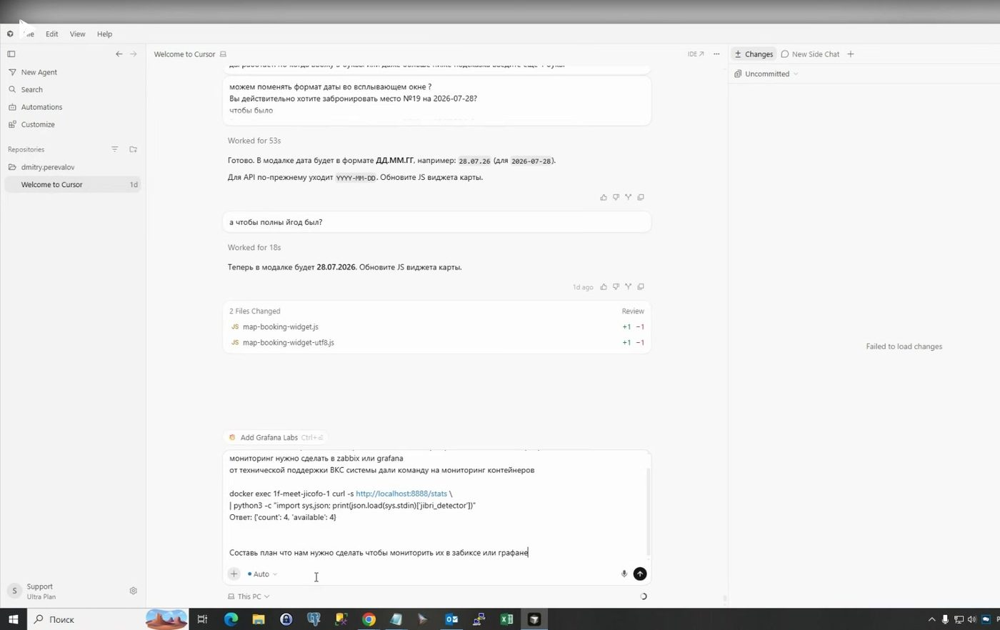

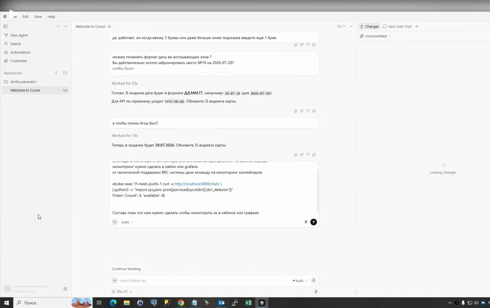

**Команда (как на экране):**

```bash
docker exec 1f-meet-jicofo-1 curl -s http://localhost:8888/stats \
| python3 -c "import sys,json; print(json.load(sys.stdin)['jibri_detector'])"
```

**Пример ответа:** `{'count': 4, 'available': 4}`

Черновик промпта до вставки полной команды:

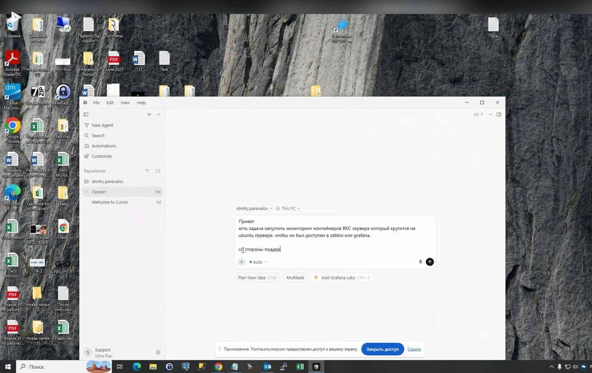

### Замечания

- Имя контейнера на записи: **`1f-meet-jicofo-1`**. В ответе агента отдельно предупреждение: имя может смениться после `docker compose up` — лучше резолвить по label / `docker ps`.
- Endpoint внутри контейнера: `http://localhost:8888/stats` (порт **8888**, не 3000).
- Это **не** общий docker stats по CPU/RAM контейнеров, а прикладной датчик пула Jibri.

---

## 3. План агента Cursor: Zabbix vs Grafana

Агент в чате **Container monitoring setup** разобрал оба варианта и рекомендовал начать с Zabbix.

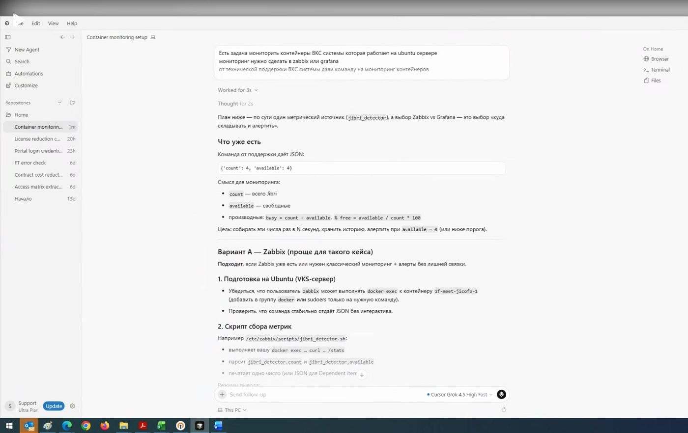

### 3.1. Вариант A — Zabbix (предпочтительный на записи)

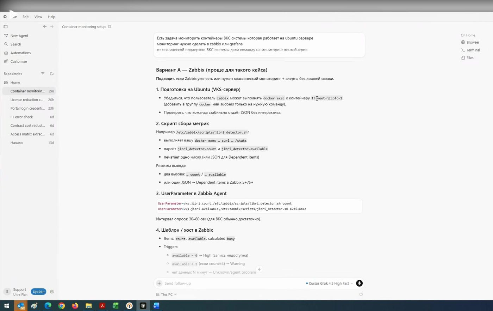

Шаги (по тексту ответа агента на экране):

1. **Подготовка на Ubuntu (VKS-сервер)**  
   Пользователь `zabbix` должен уметь выполнять `docker exec` к `1f-meet-jicofo-1` (группа `docker` или `sudoers` только на нужную команду). Команда должна стабильно отдавать JSON без `-it`/интерактива.
2. **Скрипт сбора** — например `/etc/zabbix/scripts/jibri_detector.sh`:  
   `docker exec … curl … /stats` → парсинг `jibri_detector.count` / `.available` → одно число или JSON для Dependent items.
3. **UserParameter в Zabbix Agent:**
   ```text
   UserParameter=vks.jibri.count,/etc/zabbix/scripts/jibri_detector.sh count
   UserParameter=vks.jibri.available,/etc/zabbix/scripts/jibri_detector.sh available
   ```
   Интервал опроса: 30–60 с.
4. **Шаблон / хост:** items `count`, `available`, calculated `busy`; triggers:
   - `available = 0` — High (запись недоступна);
   - `available < 2` (при `count=4`) — Warning;
   - нет данных N минут — Unknown / agent problem;
   - graph `available` vs `count`.
5. **Права:** не давать `zabbix` полный root; `sudo` только на `docker exec 1f-meet-jicofo-1 curl …`.
6. **Опционально:** другие поля `/stats` (конференции, участники) — попросить у ТП полный пример JSON.

### 3.2. Вариант B — Grafana (+ Prometheus)

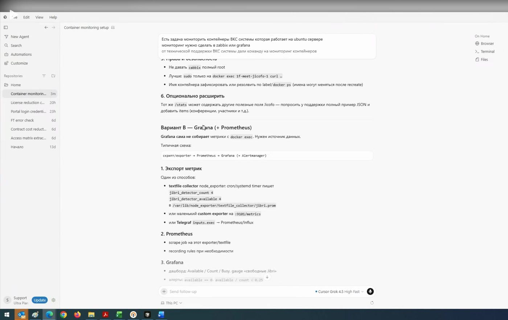

Grafana сама **не** собирает метрики через `docker exec`. Нужна цепочка:

`скрипт/exporter → Prometheus → Grafana (+ Alertmanager)`

Варианты экспорта с экрана:
- textfile collector `node_exporter` → файл вида `/var/lib/node_exporter/textfile_collector/jibri.prom`;
- custom exporter на `:9101/metrics`;
- Telegraf `inputs.exec`.

### 3.3. MVP-чеклист и риски

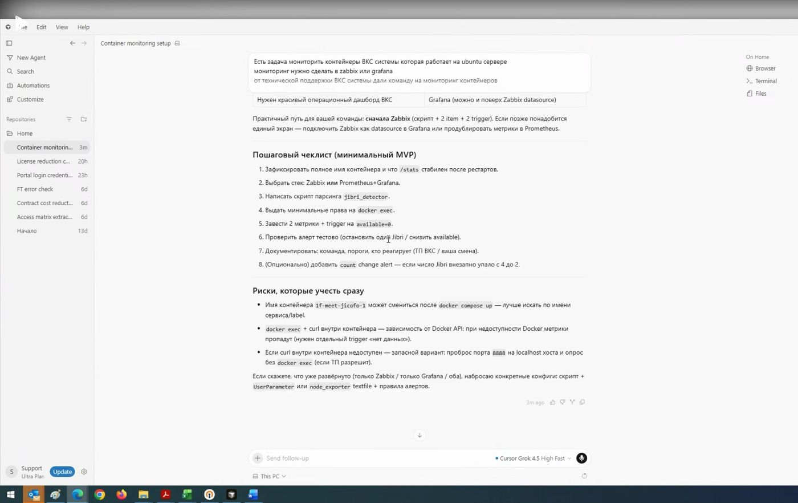

**Чеклист MVP (с экрана):**
1. Зафиксировать полное имя контейнера и стабильность `/stats` после рестартов.
2. Выбрать стек: Zabbix или Prometheus+Grafana.
3. Написать скрипт парсинга `jibri_detector`.
4. Выдать минимальные права на `docker exec`.
5. Завести 2 метрики + trigger на `available = 0`.
6. Проверить алерт тестово (остановить один Jibri / снизить `available`).
7. Документировать команду, пороги, кто реагирует (ТП ВКС / смена).
8. Опционально: алерт на внезапное падение `count` (например с 4 до 2).

**Риски (с экрана):**
- имя контейнера может смениться после recreate;
- зависимость от Docker API — при недоступности Docker метрики пропадут (нужен trigger «нет данных»);
- запасной вариант: проброс порта на localhost хоста и опрос без `docker exec` (если ТП разрешит; в тексте агента упоминался порт 8888).

**Практичный путь (рекомендация агента + итог встречи):** сначала Zabbix (скрипт + 2 item + trigger). При необходимости позже — Zabbix как datasource в Grafana или дублирование в Prometheus.

---

## 4. Что видно в текущей Grafana

Коля показал корпоративную Grafana: для своей разработки источники есть, **инфраструктуры 1Формы/ВКС там нет**.

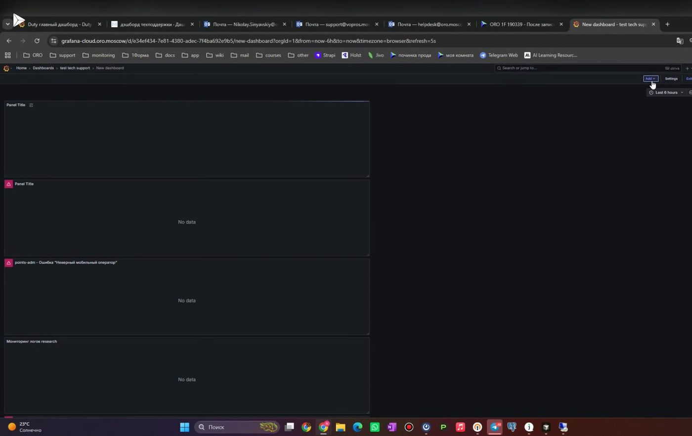

URL с экрана: https://grafana-cloud.oro.moscow (дашборд в папке `test tech support` → New dashboard).

При **Add visualization / Edit panel** доступные data sources (с экрана):

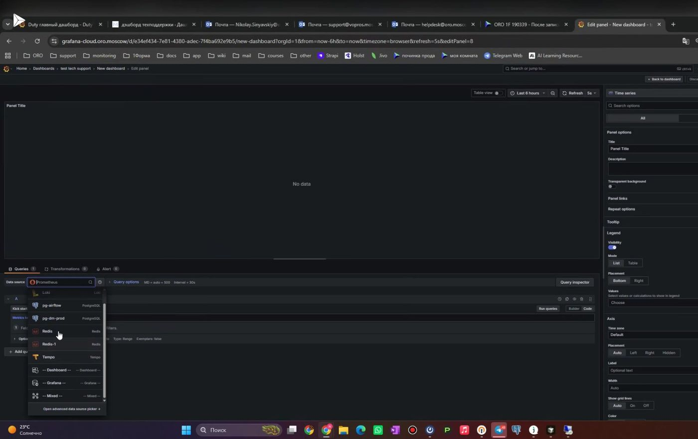

- Prometheus (default)
- Loki
- PostgreSQL (`pg-airflow`, `pg-dm-prod` и аналоги)
- Redis
- Tempo
- встроенные `-- Dashboard --` / `-- Grafana --` / `-- Mixed --`

В Metrics browser по Prometheus видны в основном метрики **Airflow** и своих сервисов — не контейнеры Meet/ВКС:

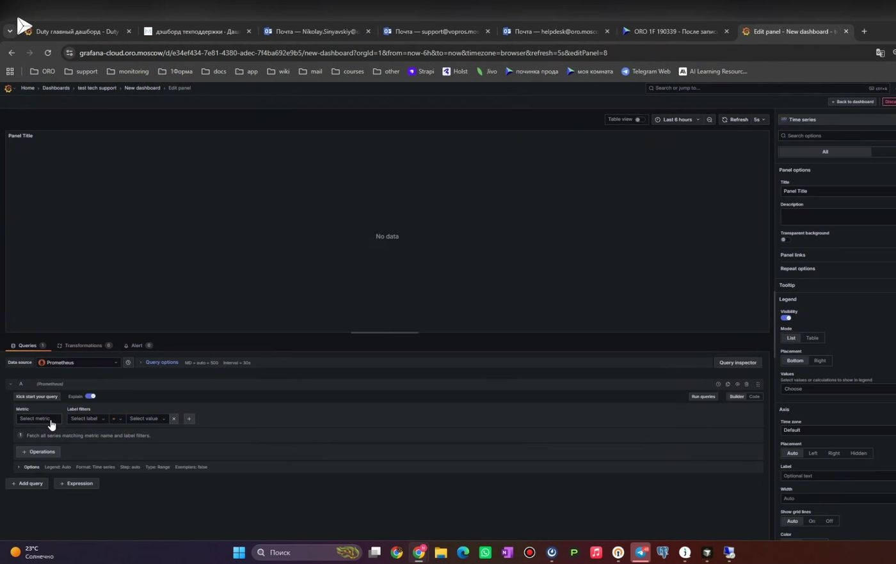

### Вывод с встречи (устно + экран)

- Подключить метрики ВКС/1Формы «просто так» в эту Grafana нельзя: нужен путь метрик в Prometheus (или иной DS), которого сейчас нет.
- Устно: у Коли в Grafana доступны сервисы вроде folder-access-controller и своей разработки; доступ к инфраструктуре первой формы отсутствует.
- Устно: Петр ранее выводил мониторинг первой формы в **Zabbix**, а не в Grafana — это согласуется с выводом агента «на Zabbix проще».

---

## 5. Что уже есть в Zabbix (`One_Forma`)

На записи открыт существующий дашборд инфраструктуры 1Формы.

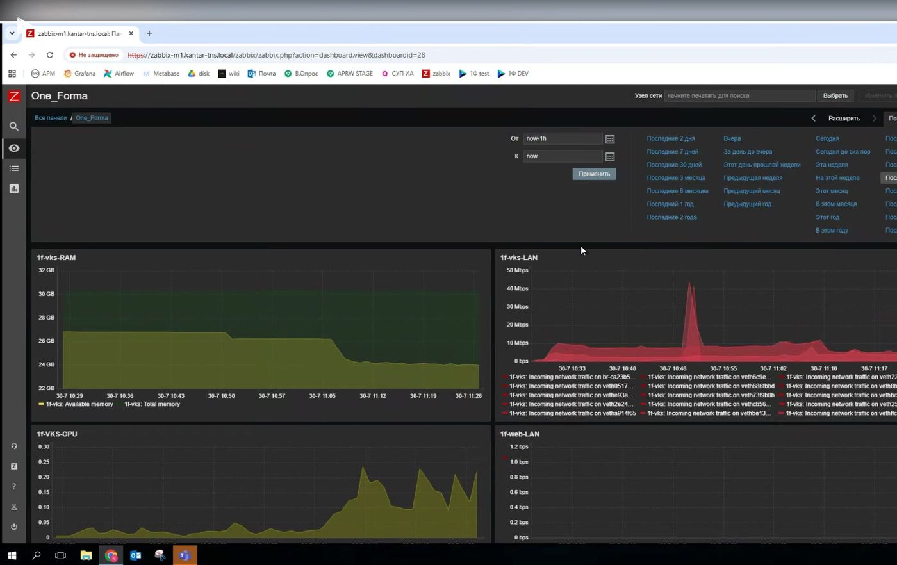


- **URL:** https://zabbix-m1.kantar-tns.local/zabbix/zabbix.php?action=dashboard.view&dashboardid=28  
- **Имя дашборда:** `One_Forma`
- **На экране видны графики:** `1f-vks-RAM`, `1f-vks-LAN`, `1f-vks-CPU`, `1f-web-LAN` (и рядом блоки по web/DB — в зависимости от прокрутки).
- Версия Zabbix на странице (по разбору UI): **5.4.10**.
- При открытии Chrome показывает предупреждение сертификата (`NET::ERR_CERT_COMMON_NAME_INVALID`) — заход через «Дополнительно / продолжить».

> Важно: на дашборде уже есть **хостовый** мониторинг `1f-vks` (RAM/CPU/сеть). Метрик **`jibri_detector` / свободных Jibri на записи не видно** — их как раз предлагается добавить.

---

## 6. Решение встречи и следующие шаги

Итог (устно, конец записи):

1. Мониторинг контейнеров/Jibri для ВКС вести в **Zabbix**, рядом с уже существующим дашбордом `One_Forma`.
2. Написать **Петру** (на момент записи — в отпуске; планировали написать на следующий день), что ТП ВКС передала команду сбора `jibri_detector`, и попросить добавить метрики/графики/алерты на дашборд.
3. Дополнительных метрик «кроме контейнеров» на встрече не зафиксировали — придумать можно позже.
4. Вторую тему (импорт данных/калькуляций) отложили: текущую запись остановить и начать новую.

Опора для запроса к Петру — команда из раздела 2 + план Zabbix из раздела 3.1.

---

## 7. Чек-лист поддержки

- [ ] Команда ТП выполняется на VKS-хосте и стабильно возвращает `count`/`available`
- [ ] Имя контейнера зафиксировано или резолвится по label (не зашито вслепую навсегда)
- [ ] Учётке опроса выданы минимальные права на `docker exec` / curl к `/stats`
- [ ] В Zabbix заведены items `vks.jibri.count` и `vks.jibri.available`
- [ ] Trigger на `available = 0` (и при необходимости soft-порог)
- [ ] Trigger на отсутствие данных
- [ ] Метрики выведены на дашборд (логичный кандидат: `One_Forma`, dashboardid=28)
- [ ] Понятно, кто реагирует на алерт (ТП ВКС / внутренняя смена)
- [ ] Grafana **не** требуется для MVP; подключать только если появится Prometheus-путь или Zabbix datasource

---

## 8. Ссылки

- Запись ВКС: https://vks.oro.moscow/records/5d8feea9-d3a4-4357-afd8-5346cae2e045/user2368_2026-07-30-11-06-25.mp4
- Grafana: https://grafana-cloud.oro.moscow
- Zabbix дашборд `One_Forma`: https://zabbix-m1.kantar-tns.local/zabbix/zabbix.php?action=dashboard.view&dashboardid=28
- Wiki-страница этой инструкции: https://github.com/hommtoe121-del/test-rep/wiki/Мониторинг-контейнеров-ВКС-jibri

### Легенда фактов

| Метка | Смысл |
|---|---|
| «с экрана» | URL, команда, имена DS/графиков, текст ответа агента — сверены по кадрам/OCR |
| «устно» | решение идти к Петру, оценка прав Grafana, отложенная вторая тема — по транскрипту речи |
